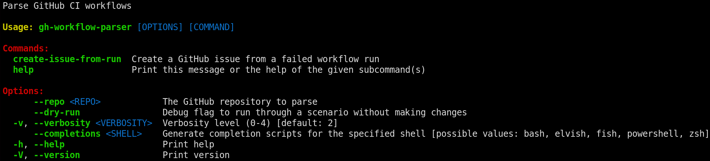

# GitHub Workflow Parser

- [GitHub Workflow Parser](#github-workflow-parser)
- [Purpose](#purpose)
- [Installation](#installation)
- [Usage](#usage)
  - [Example of a created issue's body](#example-of-a-created-issues-body)
    - [`Test template xilinx` (ID 21442749267)](#test-template-xilinx-id-21442749267)
- [Code documentation](#code-documentation)


# Purpose

Make automatic issue creation a lot smarter. Adding error labels, link to specific runs and appropriate error logs.


# Installation

Build from source or install with `cargo install gh-workflow-parser`

# Usage
Run `gh-workflow-parse --help` to get started.


## Example of a created issue's body
**Run ID**: 7858139663 [LINK TO RUN](github.com/luftkode/distro-template/actions/runs/7858139663)

**1 job failed:**
- **`Test template xilinx`**

### `Test template xilinx` (ID 21442749267)
**Step failed:** `📦 Build yocto image`
\
**Log:** github.com/luftkode/distro-template/actions/runs/7858139663/job/21442749267
\
*Best effort error summary*:
```
ERROR: sqlite3-native-3_3.43.2-r0 do_fetch: Bitbake Fetcher Error: MalformedUrl('${SOURCE_MIRROR_URL}')
ERROR: Logfile of failure stored in: /app/yocto/build/tmp/work/x86_64-linux/sqlite3-native/3.43.2/temp/log.do_fetch.21616
ERROR: Task (virtual:native:/app/yocto/build/../poky/meta/recipes-support/sqlite/sqlite3_3.43.2.bb:do_fetch) failed with exit code '1'

2024-02-11 00:09:04 - ERROR    - Command "/app/yocto/poky/bitbake/bin/bitbake -c build test-template-ci-xilinx-image package-index" failed with error 1
```
<details>
<summary>log.do_fetch.21616</summary>
<br>

```
blabla error
```
</details>


# Code documentation
Available [HERE](https://docs.rs/gh-workflow-parser/latest/gh_workflow_parser/)
